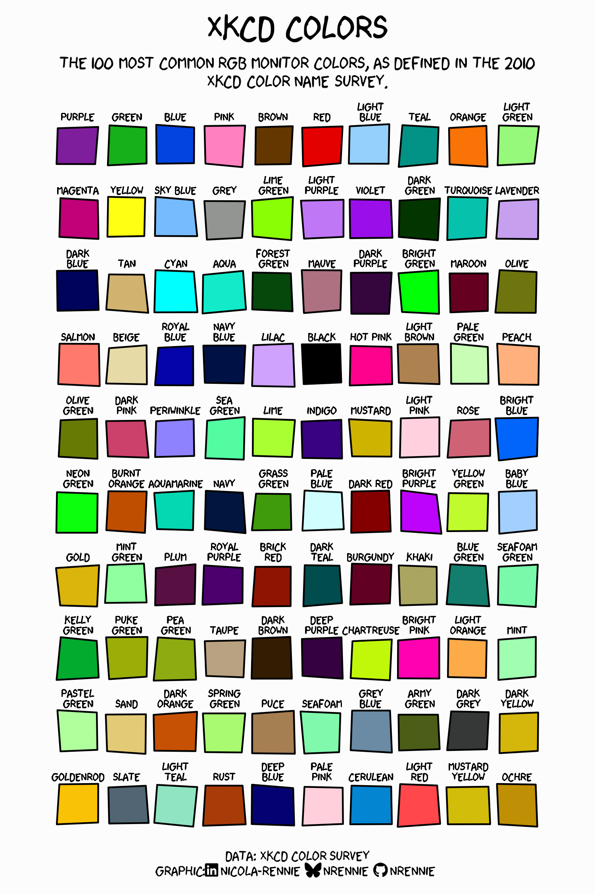

# XKCD Color Survey

In 2010, XKCD ran a survey asking people to name colors. This repository processes the raw survey data into a more usable format.

## Data

`color_ranks`

* `color`: The name of the color (for the 954 most common RGB monitor colors only)
* `rank`: The rank of the color
* `hex`: The hex code of the color

`answers` (This table is a subset of the full answers data where the `color_name_answer` was one of the names of the 5 top ranked colors in the `color_ranks` data)

* `user_id`: The id of the user who gave the answer
* `hex`: Hex code of the color shown to a user 
* `rank`: The rank of the color that the user gave as the name of the color they were shown (join with `color_ranks`to get the color name answer given by the user)

`users`

* `user_id`: The id of the user
* `monitor`: The user's monitor type
* `y_chromosome`: Whether or not the user reported having a Y chromosome (data recorded since chromosomal sex is related to colorblindness)
* `colorblind`: Whether or not the user reported being colorblind
* `spam_prob`: Probability of the user being a spam user. Note some values exceed 1.

## Links

The data used can be accessed at the following links:

* **XKCD blog post**: [blog.xkcd.com/2010/05/03/color-survey-results](https://blog.xkcd.com/2010/05/03/color-survey-results/)

* **`xkcdcolors` R package**: [cran.r-project.org/web/packages/xkcdcolors/index.html](https://cran.r-project.org/web/packages/xkcdcolors/index.html)

## Plot

The R code used to produce the poster-style visualisation below is available in `R/04_plot.R`.

